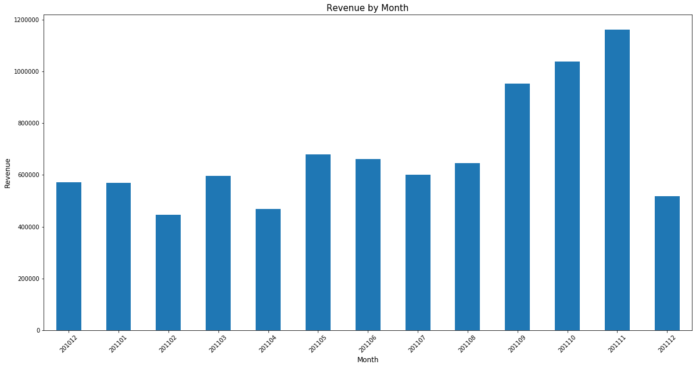

사용 데이터셋:

[Online Retail Data Set (kaggle.com)](https://www.kaggle.com/datasets/vijayuv/onlineretail)


# 1. 고객 주문 데이터 파악하기

## 1-1. 데이터 셋

- 가상 온라인 리테일 사이트의 주문 기록 데이터
- 약 50만건


```python
import numpy as np
import pandas as pd
```


```python
pd.read_csv('Online Retail.csv')
```


<div>
<style scoped>
    .dataframe tbody tr th:only-of-type {
        vertical-align: middle;
    }


    .dataframe tbody tr th {
        vertical-align: top;
    }
    
    .dataframe thead th {
        text-align: right;
    }

</style>

<table border="1" class="dataframe">
  <thead>
    <tr style="text-align: right;">
      <th></th>
      <th>InvoiceNo</th>
      <th>StockCode</th>
      <th>Description</th>
      <th>Quantity</th>
      <th>InvoiceDate</th>
      <th>UnitPrice</th>
      <th>CustomerID</th>
      <th>Country</th>
    </tr>
  </thead>
  <tbody>
    <tr>
      <th>0</th>
      <td>536365</td>
      <td>85123A</td>
      <td>WHITE HANGING HEART T-LIGHT HOLDER</td>
      <td>6</td>
      <td>2010-12-01 8:26</td>
      <td>2.55</td>
      <td>17850.0</td>
      <td>United Kingdom</td>
    </tr>
    <tr>
      <th>1</th>
      <td>536365</td>
      <td>71053</td>
      <td>WHITE METAL LANTERN</td>
      <td>6</td>
      <td>2010-12-01 8:26</td>
      <td>3.39</td>
      <td>17850.0</td>
      <td>United Kingdom</td>
    </tr>
    <tr>
      <th>2</th>
      <td>536365</td>
      <td>84406B</td>
      <td>CREAM CUPID HEARTS COAT HANGER</td>
      <td>8</td>
      <td>2010-12-01 8:26</td>
      <td>2.75</td>
      <td>17850.0</td>
      <td>United Kingdom</td>
    </tr>
    <tr>
      <th>3</th>
      <td>536365</td>
      <td>84029G</td>
      <td>KNITTED UNION FLAG HOT WATER BOTTLE</td>
      <td>6</td>
      <td>2010-12-01 8:26</td>
      <td>3.39</td>
      <td>17850.0</td>
      <td>United Kingdom</td>
    </tr>
    <tr>
      <th>4</th>
      <td>536365</td>
      <td>84029E</td>
      <td>RED WOOLLY HOTTIE WHITE HEART.</td>
      <td>6</td>
      <td>2010-12-01 8:26</td>
      <td>3.39</td>
      <td>17850.0</td>
      <td>United Kingdom</td>
    </tr>
    <tr>
      <th>...</th>
      <td>...</td>
      <td>...</td>
      <td>...</td>
      <td>...</td>
      <td>...</td>
      <td>...</td>
      <td>...</td>
      <td>...</td>
    </tr>
    <tr>
      <th>541904</th>
      <td>581587</td>
      <td>22613</td>
      <td>PACK OF 20 SPACEBOY NAPKINS</td>
      <td>12</td>
      <td>2011-12-09 12:50</td>
      <td>0.85</td>
      <td>12680.0</td>
      <td>France</td>
    </tr>
    <tr>
      <th>541905</th>
      <td>581587</td>
      <td>22899</td>
      <td>CHILDREN'S APRON DOLLY GIRL</td>
      <td>6</td>
      <td>2011-12-09 12:50</td>
      <td>2.10</td>
      <td>12680.0</td>
      <td>France</td>
    </tr>
    <tr>
      <th>541906</th>
      <td>581587</td>
      <td>23254</td>
      <td>CHILDRENS CUTLERY DOLLY GIRL</td>
      <td>4</td>
      <td>2011-12-09 12:50</td>
      <td>4.15</td>
      <td>12680.0</td>
      <td>France</td>
    </tr>
    <tr>
      <th>541907</th>
      <td>581587</td>
      <td>23255</td>
      <td>CHILDRENS CUTLERY CIRCUS PARADE</td>
      <td>4</td>
      <td>2011-12-09 12:50</td>
      <td>4.15</td>
      <td>12680.0</td>
      <td>France</td>
    </tr>
    <tr>
      <th>541908</th>
      <td>581587</td>
      <td>22138</td>
      <td>BAKING SET 9 PIECE RETROSPOT</td>
      <td>3</td>
      <td>2011-12-09 12:50</td>
      <td>4.95</td>
      <td>12680.0</td>
      <td>France</td>
    </tr>
  </tbody>
</table>
<p>541909 rows × 8 columns</p>

</div>


```python
retail=pd.read_csv('Online Retail.csv')
```


```python
retail.info()
```

    <class 'pandas.core.frame.DataFrame'>
    RangeIndex: 541909 entries, 0 to 541908
    Data columns (total 8 columns):
     #   Column       Non-Null Count   Dtype  
    ---  ------       --------------   -----  
     0   InvoiceNo    541909 non-null  object 
     1   StockCode    541909 non-null  object 
     2   Description  540455 non-null  object 
     3   Quantity     541909 non-null  int64  
     4   InvoiceDate  541909 non-null  object 
     5   UnitPrice    541909 non-null  float64
     6   CustomerID   406829 non-null  float64
     7   Country      541909 non-null  object 
    dtypes: float64(2), int64(1), object(5)
    memory usage: 33.1+ MB


## 1-2. 컬럼 살펴보기

- InvoiceNo: 주문번호
- StockCode : 아이템 아이디
- Description: 상품설명
- Quantity: 상품 주문 수량
- InvoiceDate : 주문 시간
- UnitPrice: 상품 가격
- CustomerID: 고객 아이디
- Country: 고객 거주 지역


```python
retail.columns
```


    Index(['InvoiceNo', 'StockCode', 'Description', 'Quantity', 'InvoiceDate',
           'UnitPrice', 'CustomerID', 'Country'],
          dtype='object')


```python
#각 필드당 null이 몇개있는지 확인
retail.isnull().sum()
```


    InvoiceNo           0
    StockCode           0
    Description      1454
    Quantity            0
    InvoiceDate         0
    UnitPrice           0
    CustomerID     135080
    Country             0
    dtype: int64


```python
#비회원을 제거
retail=retail[pd.notnull(retail['CustomerID'])]
```


```python
len(retail)
```


    406829


```python
#구입 수량이 1이상, 구입 가격이 1이상인 데이터만 저장
retail = retail[retail['Quantity']>0]
retail = retail[retail['UnitPrice']>0]
```


```python
len(retail)
```


    397884


```python
retail.info()
```

    <class 'pandas.core.frame.DataFrame'>
    Int64Index: 397884 entries, 0 to 541908
    Data columns (total 8 columns):
     #   Column       Non-Null Count   Dtype  
    ---  ------       --------------   -----  
     0   InvoiceNo    397884 non-null  object 
     1   StockCode    397884 non-null  object 
     2   Description  397884 non-null  object 
     3   Quantity     397884 non-null  int64  
     4   InvoiceDate  397884 non-null  object 
     5   UnitPrice    397884 non-null  float64
     6   CustomerID   397884 non-null  float64
     7   Country      397884 non-null  object 
    dtypes: float64(2), int64(1), object(5)
    memory usage: 27.3+ MB


```python
# 고객의 총 지출 비용(Checkout Price) 구하기
# 수량 * 가격 = 고객의 총 지출비용
retail['CheckOutPriceretail']=retail['Quantity']*retail['UnitPrice']
retail.head()
```


<div>
<style scoped>
    .dataframe tbody tr th:only-of-type {
        vertical-align: middle;
    }


    .dataframe tbody tr th {
        vertical-align: top;
    }
    
    .dataframe thead th {
        text-align: right;
    }

</style>

<table border="1" class="dataframe">
  <thead>
    <tr style="text-align: right;">
      <th></th>
      <th>InvoiceNo</th>
      <th>StockCode</th>
      <th>Description</th>
      <th>Quantity</th>
      <th>InvoiceDate</th>
      <th>UnitPrice</th>
      <th>CustomerID</th>
      <th>Country</th>
      <th>CheckOutPriceretail</th>
    </tr>
  </thead>
  <tbody>
    <tr>
      <th>0</th>
      <td>536365</td>
      <td>85123A</td>
      <td>WHITE HANGING HEART T-LIGHT HOLDER</td>
      <td>6</td>
      <td>2010-12-01 8:26</td>
      <td>2.55</td>
      <td>17850.0</td>
      <td>United Kingdom</td>
      <td>15.30</td>
    </tr>
    <tr>
      <th>1</th>
      <td>536365</td>
      <td>71053</td>
      <td>WHITE METAL LANTERN</td>
      <td>6</td>
      <td>2010-12-01 8:26</td>
      <td>3.39</td>
      <td>17850.0</td>
      <td>United Kingdom</td>
      <td>20.34</td>
    </tr>
    <tr>
      <th>2</th>
      <td>536365</td>
      <td>84406B</td>
      <td>CREAM CUPID HEARTS COAT HANGER</td>
      <td>8</td>
      <td>2010-12-01 8:26</td>
      <td>2.75</td>
      <td>17850.0</td>
      <td>United Kingdom</td>
      <td>22.00</td>
    </tr>
    <tr>
      <th>3</th>
      <td>536365</td>
      <td>84029G</td>
      <td>KNITTED UNION FLAG HOT WATER BOTTLE</td>
      <td>6</td>
      <td>2010-12-01 8:26</td>
      <td>3.39</td>
      <td>17850.0</td>
      <td>United Kingdom</td>
      <td>20.34</td>
    </tr>
    <tr>
      <th>4</th>
      <td>536365</td>
      <td>84029E</td>
      <td>RED WOOLLY HOTTIE WHITE HEART.</td>
      <td>6</td>
      <td>2010-12-01 8:26</td>
      <td>3.39</td>
      <td>17850.0</td>
      <td>United Kingdom</td>
      <td>20.34</td>
    </tr>
  </tbody>
</table>

</div>


```python
retail.to_csv('OnlineRetailClean.csv')
```


```python
retail=pd.read_csv('OnlineRetailClean.csv')
```


```python
retail.info()
```

    <class 'pandas.core.frame.DataFrame'>
    RangeIndex: 397884 entries, 0 to 397883
    Data columns (total 10 columns):
     #   Column               Non-Null Count   Dtype  
    ---  ------               --------------   -----  
     0   Unnamed: 0           397884 non-null  int64  
     1   InvoiceNo            397884 non-null  int64  
     2   StockCode            397884 non-null  object 
     3   Description          397884 non-null  object 
     4   Quantity             397884 non-null  int64  
     5   InvoiceDate          397884 non-null  object 
     6   UnitPrice            397884 non-null  float64
     7   CustomerID           397884 non-null  float64
     8   Country              397884 non-null  object 
     9   CheckOutPriceretail  397884 non-null  float64
    dtypes: float64(3), int64(3), object(4)
    memory usage: 30.4+ MB


```python
#원하는 타입으로 데이터 불러오기
dtypes={'UnitPrice':np.float32,'CustomerID': np.int32,'Quantity':np.int32}
retail=pd.read_csv('OnlineRetailClean.csv',dtype=dtypes)
```


```python
retail.info()
```

    <class 'pandas.core.frame.DataFrame'>
    RangeIndex: 397884 entries, 0 to 397883
    Data columns (total 10 columns):
     #   Column               Non-Null Count   Dtype  
    ---  ------               --------------   -----  
     0   Unnamed: 0           397884 non-null  int64  
     1   InvoiceNo            397884 non-null  int64  
     2   StockCode            397884 non-null  object 
     3   Description          397884 non-null  object 
     4   Quantity             397884 non-null  int32  
     5   InvoiceDate          397884 non-null  object 
     6   UnitPrice            397884 non-null  float32
     7   CustomerID           397884 non-null  int32  
     8   Country              397884 non-null  object 
     9   CheckOutPriceretail  397884 non-null  float64
    dtypes: float32(1), float64(1), int32(2), int64(2), object(4)
    memory usage: 25.8+ MB


## 1-3. 날짜 데이터 타입 변환

- 문자열로 데이터를 로딩하는 것보다 datetime으로 로딩하는 것이 날짜 분석 및 계산에 용이


```python
retail.head()
```


<div>
<style scoped>
    .dataframe tbody tr th:only-of-type {
        vertical-align: middle;
    }


    .dataframe tbody tr th {
        vertical-align: top;
    }
    
    .dataframe thead th {
        text-align: right;
    }

</style>

<table border="1" class="dataframe">
  <thead>
    <tr style="text-align: right;">
      <th></th>
      <th>Unnamed: 0</th>
      <th>InvoiceNo</th>
      <th>StockCode</th>
      <th>Description</th>
      <th>Quantity</th>
      <th>InvoiceDate</th>
      <th>UnitPrice</th>
      <th>CustomerID</th>
      <th>Country</th>
      <th>CheckOutPriceretail</th>
    </tr>
  </thead>
  <tbody>
    <tr>
      <th>0</th>
      <td>0</td>
      <td>536365</td>
      <td>85123A</td>
      <td>WHITE HANGING HEART T-LIGHT HOLDER</td>
      <td>6</td>
      <td>2010-12-01 8:26</td>
      <td>2.55</td>
      <td>17850</td>
      <td>United Kingdom</td>
      <td>15.30</td>
    </tr>
    <tr>
      <th>1</th>
      <td>1</td>
      <td>536365</td>
      <td>71053</td>
      <td>WHITE METAL LANTERN</td>
      <td>6</td>
      <td>2010-12-01 8:26</td>
      <td>3.39</td>
      <td>17850</td>
      <td>United Kingdom</td>
      <td>20.34</td>
    </tr>
    <tr>
      <th>2</th>
      <td>2</td>
      <td>536365</td>
      <td>84406B</td>
      <td>CREAM CUPID HEARTS COAT HANGER</td>
      <td>8</td>
      <td>2010-12-01 8:26</td>
      <td>2.75</td>
      <td>17850</td>
      <td>United Kingdom</td>
      <td>22.00</td>
    </tr>
    <tr>
      <th>3</th>
      <td>3</td>
      <td>536365</td>
      <td>84029G</td>
      <td>KNITTED UNION FLAG HOT WATER BOTTLE</td>
      <td>6</td>
      <td>2010-12-01 8:26</td>
      <td>3.39</td>
      <td>17850</td>
      <td>United Kingdom</td>
      <td>20.34</td>
    </tr>
    <tr>
      <th>4</th>
      <td>4</td>
      <td>536365</td>
      <td>84029E</td>
      <td>RED WOOLLY HOTTIE WHITE HEART.</td>
      <td>6</td>
      <td>2010-12-01 8:26</td>
      <td>3.39</td>
      <td>17850</td>
      <td>United Kingdom</td>
      <td>20.34</td>
    </tr>
  </tbody>
</table>

</div>


```python
retail['InvoiceDate']=pd.to_datetime(retail['InvoiceDate'])
```


```python
retail.head()
```


<div>
<style scoped>
    .dataframe tbody tr th:only-of-type {
        vertical-align: middle;
    }


    .dataframe tbody tr th {
        vertical-align: top;
    }
    
    .dataframe thead th {
        text-align: right;
    }

</style>

<table border="1" class="dataframe">
  <thead>
    <tr style="text-align: right;">
      <th></th>
      <th>Unnamed: 0</th>
      <th>InvoiceNo</th>
      <th>StockCode</th>
      <th>Description</th>
      <th>Quantity</th>
      <th>InvoiceDate</th>
      <th>UnitPrice</th>
      <th>CustomerID</th>
      <th>Country</th>
      <th>CheckOutPriceretail</th>
    </tr>
  </thead>
  <tbody>
    <tr>
      <th>0</th>
      <td>0</td>
      <td>536365</td>
      <td>85123A</td>
      <td>WHITE HANGING HEART T-LIGHT HOLDER</td>
      <td>6</td>
      <td>2010-12-01 08:26:00</td>
      <td>2.55</td>
      <td>17850</td>
      <td>United Kingdom</td>
      <td>15.30</td>
    </tr>
    <tr>
      <th>1</th>
      <td>1</td>
      <td>536365</td>
      <td>71053</td>
      <td>WHITE METAL LANTERN</td>
      <td>6</td>
      <td>2010-12-01 08:26:00</td>
      <td>3.39</td>
      <td>17850</td>
      <td>United Kingdom</td>
      <td>20.34</td>
    </tr>
    <tr>
      <th>2</th>
      <td>2</td>
      <td>536365</td>
      <td>84406B</td>
      <td>CREAM CUPID HEARTS COAT HANGER</td>
      <td>8</td>
      <td>2010-12-01 08:26:00</td>
      <td>2.75</td>
      <td>17850</td>
      <td>United Kingdom</td>
      <td>22.00</td>
    </tr>
    <tr>
      <th>3</th>
      <td>3</td>
      <td>536365</td>
      <td>84029G</td>
      <td>KNITTED UNION FLAG HOT WATER BOTTLE</td>
      <td>6</td>
      <td>2010-12-01 08:26:00</td>
      <td>3.39</td>
      <td>17850</td>
      <td>United Kingdom</td>
      <td>20.34</td>
    </tr>
    <tr>
      <th>4</th>
      <td>4</td>
      <td>536365</td>
      <td>84029E</td>
      <td>RED WOOLLY HOTTIE WHITE HEART.</td>
      <td>6</td>
      <td>2010-12-01 08:26:00</td>
      <td>3.39</td>
      <td>17850</td>
      <td>United Kingdom</td>
      <td>20.34</td>
    </tr>
  </tbody>
</table>

</div>


```python
retail= retail.drop('Unnamed: 0',axis=1)
```


```python
retail.head()
```


<div>
<style scoped>
    .dataframe tbody tr th:only-of-type {
        vertical-align: middle;
    }


    .dataframe tbody tr th {
        vertical-align: top;
    }
    
    .dataframe thead th {
        text-align: right;
    }

</style>

<table border="1" class="dataframe">
  <thead>
    <tr style="text-align: right;">
      <th></th>
      <th>InvoiceNo</th>
      <th>StockCode</th>
      <th>Description</th>
      <th>Quantity</th>
      <th>InvoiceDate</th>
      <th>UnitPrice</th>
      <th>CustomerID</th>
      <th>Country</th>
      <th>CheckOutPriceretail</th>
    </tr>
  </thead>
  <tbody>
    <tr>
      <th>0</th>
      <td>536365</td>
      <td>85123A</td>
      <td>WHITE HANGING HEART T-LIGHT HOLDER</td>
      <td>6</td>
      <td>2010-12-01 08:26:00</td>
      <td>2.55</td>
      <td>17850</td>
      <td>United Kingdom</td>
      <td>15.30</td>
    </tr>
    <tr>
      <th>1</th>
      <td>536365</td>
      <td>71053</td>
      <td>WHITE METAL LANTERN</td>
      <td>6</td>
      <td>2010-12-01 08:26:00</td>
      <td>3.39</td>
      <td>17850</td>
      <td>United Kingdom</td>
      <td>20.34</td>
    </tr>
    <tr>
      <th>2</th>
      <td>536365</td>
      <td>84406B</td>
      <td>CREAM CUPID HEARTS COAT HANGER</td>
      <td>8</td>
      <td>2010-12-01 08:26:00</td>
      <td>2.75</td>
      <td>17850</td>
      <td>United Kingdom</td>
      <td>22.00</td>
    </tr>
    <tr>
      <th>3</th>
      <td>536365</td>
      <td>84029G</td>
      <td>KNITTED UNION FLAG HOT WATER BOTTLE</td>
      <td>6</td>
      <td>2010-12-01 08:26:00</td>
      <td>3.39</td>
      <td>17850</td>
      <td>United Kingdom</td>
      <td>20.34</td>
    </tr>
    <tr>
      <th>4</th>
      <td>536365</td>
      <td>84029E</td>
      <td>RED WOOLLY HOTTIE WHITE HEART.</td>
      <td>6</td>
      <td>2010-12-01 08:26:00</td>
      <td>3.39</td>
      <td>17850</td>
      <td>United Kingdom</td>
      <td>20.34</td>
    </tr>
  </tbody>
</table>

</div>


## 1-4. 매출 구하기


```python
#전체 매출
total_revenue=retail['CheckOutPriceretail'].sum()
total_revenue
```


    8911407.904


```python
#국가별 매출
rev_by_countries=retail.groupby('Country').sum()['CheckOutPriceretail'].sort_values()
rev_by_countries
```


    Country
    Saudi Arabia            1.459200e+02
    Bahrain                 5.484000e+02
    Czech Republic          8.267400e+02
    RSA                     1.002310e+03
    Brazil                  1.143600e+03
    European Community      1.300250e+03
    Lithuania               1.661060e+03
    Lebanon                 1.693880e+03
    United Arab Emirates    1.902280e+03
    Unspecified             2.667070e+03
    Malta                   2.725590e+03
    USA                     3.580390e+03
    Canada                  3.666380e+03
    Iceland                 4.310000e+03
    Greece                  4.760520e+03
    Israel                  7.221690e+03
    Poland                  7.334650e+03
    Austria                 1.019868e+04
    Cyprus                  1.359038e+04
    Italy                   1.748324e+04
    Denmark                 1.895534e+04
    Channel Islands         2.045044e+04
    Singapore               2.127929e+04
    Finland                 2.254608e+04
    Portugal                3.343989e+04
    Norway                  3.616544e+04
    Japan                   3.741637e+04
    Sweden                  3.837833e+04
    Belgium                 4.119634e+04
    Switzerland             5.644395e+04
    Spain                   6.157711e+04
    Australia               1.385213e+05
    France                  2.090240e+05
    Germany                 2.288671e+05
    EIRE                    2.655459e+05
    Netherlands             2.854463e+05
    United Kingdom          7.308392e+06
    Name: CheckOutPriceretail, dtype: float64


```python
plot=rev_by_countries.plot(kind='bar',figsize=(20,10))
plot.set_xlabel('Country',fontsize=12)
plot.set_ylabel('Country',fontsize=12)
plot.set_title('Revenue by Country',fontsize=15)
plot.set_xticklabels(labels=rev_by_countries.index, rotation=45)
```


    [Text(0, 0, 'Saudi Arabia'),
     Text(0, 0, 'Bahrain'),
     Text(0, 0, 'Czech Republic'),
     Text(0, 0, 'RSA'),
     Text(0, 0, 'Brazil'),
     Text(0, 0, 'European Community'),
     Text(0, 0, 'Lithuania'),
     Text(0, 0, 'Lebanon'),
     Text(0, 0, 'United Arab Emirates'),
     Text(0, 0, 'Unspecified'),
     Text(0, 0, 'Malta'),
     Text(0, 0, 'USA'),
     Text(0, 0, 'Canada'),
     Text(0, 0, 'Iceland'),
     Text(0, 0, 'Greece'),
     Text(0, 0, 'Israel'),
     Text(0, 0, 'Poland'),
     Text(0, 0, 'Austria'),
     Text(0, 0, 'Cyprus'),
     Text(0, 0, 'Italy'),
     Text(0, 0, 'Denmark'),
     Text(0, 0, 'Channel Islands'),
     Text(0, 0, 'Singapore'),
     Text(0, 0, 'Finland'),
     Text(0, 0, 'Portugal'),
     Text(0, 0, 'Norway'),
     Text(0, 0, 'Japan'),
     Text(0, 0, 'Sweden'),
     Text(0, 0, 'Belgium'),
     Text(0, 0, 'Switzerland'),
     Text(0, 0, 'Spain'),
     Text(0, 0, 'Australia'),
     Text(0, 0, 'France'),
     Text(0, 0, 'Germany'),
     Text(0, 0, 'EIRE'),
     Text(0, 0, 'Netherlands'),
     Text(0, 0, 'United Kingdom')]


​    

​    


## 1-5. 월별 매출 구하기


```python
retail['InvoiceDate'].sort_values(ascending=False)
```


    397883   2011-12-09 12:50:00
    397875   2011-12-09 12:50:00
    397882   2011-12-09 12:50:00
    397870   2011-12-09 12:50:00
    397871   2011-12-09 12:50:00
                     ...        
    4        2010-12-01 08:26:00
    3        2010-12-01 08:26:00
    2        2010-12-01 08:26:00
    1        2010-12-01 08:26:00
    0        2010-12-01 08:26:00
    Name: InvoiceDate, Length: 397884, dtype: datetime64[ns]


```python
def extract_month(date): #2011-12-09 12:50:00 -> 201112
    month = str(date.month)
    if date.month<10:
        month='0'+month
    return str(date.year)+month
```


```python
rev_by_month=retail.set_index('InvoiceDate').groupby(extract_month).sum()['CheckOutPriceretail']
rev_by_month
```


    201012     572713.890
    201101     569445.040
    201102     447137.350
    201103     595500.760
    201104     469200.361
    201105     678594.560
    201106     661213.690
    201107     600091.011
    201108     645343.900
    201109     952838.382
    201110    1039318.790
    201111    1161817.380
    201112     518192.790
    Name: CheckOutPriceretail, dtype: float64


```python
def plot_bar(df,xlabel,ylabel,title,rotation=45,titlesize=15,fontsize=12,figsize=(20,10)):
    plot=df.plot(kind='bar',figsize=figsize)
    plot.set_xlabel(xlabel,fontsize=fontsize)
    plot.set_ylabel(ylabel,fontsize=fontsize)
    plot.set_title(title,fontsize=titlesize)
    plot.set_xticklabels(labels=df.index, rotation=rotation)
```


```python
plot_bar(rev_by_month,'Month','Revenue','Revenue by Month')
```


 

