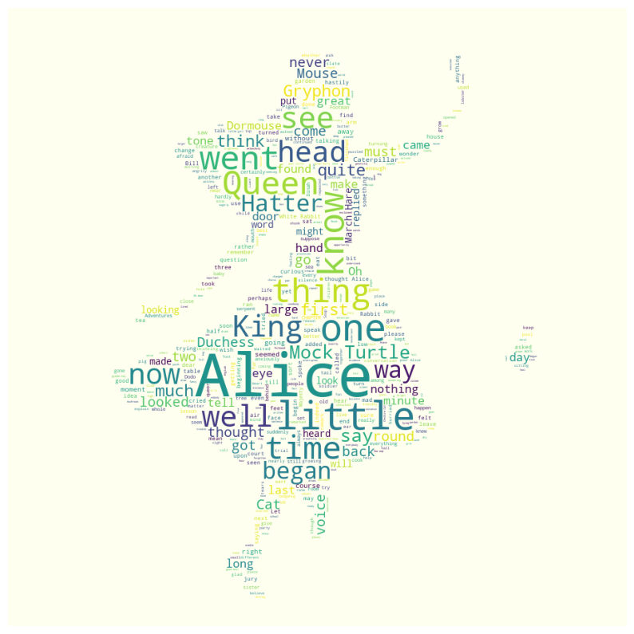

# 워드 클라우드(Word Cloud)

## 정의

- 핵심단어를 시각화하는 기법
- 문서의 키워드, 개념등을 직관적으로 파악할 수 있게 핵심 단어를 시각적으로 돋보이게 하는 기법


```python
!pip install wordcloud
```

```python
text = open('wordData.txt').read()
#print(text)
```


```python
from wordcloud import WordCloud
```


```python
# generate(): 단어별 출현 빈도수를 비율로 반환하는 객체를 생성
wordcloud = WordCloud().generate(text)
```


```python
import matplotlib.pyplot as plt

#이때 그림의 배치 등은 그때그떄 랜덤하게 생성


plt.figure(figsize = (15,10)) #plt plot사이즈 조절
plt.imshow(wordcloud,interpolation='kaiser')
plt.axis('off') #x,y축 눈금 없애기
plt.show()
```


​    


## 표시되는 단어 갯수 설정


```python
# max_words: 워드 클라우드에 표시되는 단어의 갯수를 설정
wordcloud = WordCloud(max_words=50).generate(text)

plt.figure(figsize = (15,10))
plt.imshow(wordcloud,interpolation='kaiser')
plt.axis('off') #x,y축 눈금 없애기
plt.show()
```


    

## 불용어 등록


```python
text=open('alice.txt').read()
#print(text)
```


```python
from PIL import Image
from wordcloud import STOPWORDS #불용어 등록, 워드 크라우드로 작성할 단어에서 제외할 단어를 설정
import numpy as np
```


```python
alice_mask = np.array(Image.open('alice_mask.png'))
alice_mask
```


    array([[255, 255, 255, ..., 255, 255, 255],
           [255, 255, 255, ..., 255, 255, 255],
           [255, 255, 255, ..., 255, 255, 255],
           ...,
           [255, 255, 255, ..., 255, 255, 255],
           [255, 255, 255, ..., 255, 255, 255],
           [255, 255, 255, ..., 255, 255, 255]], dtype=uint8)


```python
stopwords = set(STOPWORDS)
print(type(stopwords))
print(stopwords)
```

    <class 'set'>
    {"they'll", 'or', 'of', 'because', 'we', 'above', 'out', "i've", 'yours', 'yourselves', 'no', 'cannot', "you're", 'my', 'ever', 'shall', "we've", "haven't", "hasn't", 'himself', 'those', 'both', 'with', 'therefore', "where's", 'this', "when's", "shan't", 'than', 'some', 'while', 'does', 'just', "mustn't", "there's", "she'll", 'any', 'like', "hadn't", "here's", 'having', 'too', 'down', 'own', 'how', 'again', 'the', "you'd", "isn't", 'you', "that's", 'your', 'few', 'most', "you've", "we're", 'a', 'through', "he's", 'she', 'into', 'after', 'would', 'further', 'what', 'hence', "aren't", 'get', 'their', 'but', 'an', 'be', 'his', 'between', 'myself', 'themselves', 'on', 'yourself', 'ours', 'were', 'since', 'is', "what's", "who's", 'am', 'has', 'same', 'until', "he'll", 'it', 'against', 'only', 'in', 'over', 'these', "you'll", "we'd", 'he', 'was', "don't", 'during', 'me', 'off', "couldn't", 'if', 'its', 'there', 'when', 'are', 'hers', 'to', 'can', 'here', 'and', 'com', 'not', 'doing', "they'd", "i'd", 'k', "he'd", "we'll", 'for', "can't", 'else', 'had', 'from', "how's", 'nor', 'theirs', 'before', 'up', 'them', 'itself', "wouldn't", 'where', 'about', 'each', 'at', 'her', 'i', 'by', 'did', "i'm", 'also', 'been', 'more', 'otherwise', "weren't", "they're", "won't", 'which', "it's", 'such', "didn't", 'www', "they've", 'could', 'below', 'should', 'so', 'do', 'they', 'then', 'being', 'have', 'ought', 'as', "let's", 'herself', 'our', "she'd", 'why', 'however', "she's", 'ourselves', 'that', 'him', "why's", 'all', "doesn't", 'under', "shouldn't", 'http', 'r', "wasn't", 'who', 'whom', "i'll", 'other', 'very', 'once'}


```python
stopwords.add('said')
print(stopwords)
```

    {"they'll", 'or', 'of', 'because', 'we', 'above', 'out', "i've", 'yours', 'yourselves', 'no', 'cannot', "you're", 'my', 'ever', 'shall', "we've", "haven't", "hasn't", 'himself', 'those', 'both', 'with', 'therefore', "where's", 'this', 'said', "when's", "shan't", 'than', 'some', 'while', 'does', 'just', "mustn't", "there's", "she'll", 'any', 'like', "hadn't", "here's", 'having', 'too', 'down', 'own', 'how', 'again', 'the', "you'd", "isn't", 'you', "that's", 'your', 'few', 'most', "you've", "we're", 'a', 'through', "he's", 'she', 'into', 'after', 'would', 'further', 'what', 'hence', "aren't", 'get', 'their', 'but', 'an', 'be', 'his', 'between', 'myself', 'themselves', 'on', 'yourself', 'ours', 'were', 'since', 'is', "what's", "who's", 'am', 'has', 'same', 'until', "he'll", 'it', 'against', 'only', 'in', 'over', 'these', "you'll", "we'd", 'he', 'was', "don't", 'during', 'me', 'off', "couldn't", 'if', 'its', 'there', 'when', 'are', 'hers', 'to', 'can', 'here', 'and', 'com', 'not', 'doing', "they'd", "i'd", 'k', "he'd", "we'll", 'for', "can't", 'else', 'had', 'from', "how's", 'nor', 'theirs', 'before', 'up', 'them', 'itself', "wouldn't", 'where', 'about', 'each', 'at', 'her', 'i', 'by', 'did', "i'm", 'also', 'been', 'more', 'otherwise', "weren't", "they're", "won't", 'which', "it's", 'such', "didn't", 'www', "they've", 'could', 'below', 'should', 'so', 'do', 'they', 'then', 'being', 'have', 'ought', 'as', "let's", 'herself', 'our', "she'd", 'why', 'however', "she's", 'ourselves', 'that', 'him', "why's", 'all', "doesn't", 'under', "shouldn't", 'http', 'r', "wasn't", 'who', 'whom', "i'll", 'other', 'very', 'once'}


```python
wordcloud = WordCloud(max_words=500,background_color='ivory',stopwords=stopwords, mask=alice_mask).generate(text)

plt.figure(figsize = (10,15))
plt.imshow(wordcloud,interpolation='kaiser')
plt.axis('off') #x,y축 눈금 없애기
plt.show()
```



    


### 문제: 

1. 대한민국 헌법 테스트 파일 중 'constitution.txt'를 불러오기
2. 명사만 추출하기
3. stop_words를 아래와 같이 설정하기
   * ['제', '월', '일', '조', '수', '때', '그', '이'
     ,'바','및','정','관','위','장']
4. 명사의 빈도수를 계산해서 상위 500개의 단어만 선택
5. 위 조건에 맞는 클라우드를 만들기


## Okt() 사용


```python
!pip install konlpy
```


```python
from konlpy.corpus import kolaw
```


```python
text = kolaw.open('constitution.txt').read()
```


```python
from konlpy.tag import Okt
```


```python
okt = Okt()
noun_text = okt.nouns(text)
```


```python
stop_words=['제', '월', '일', '조', '수', '때', '그', '이' ,'바','및','정','관','위','장']
# noun_text개수 만큼 반복하면서 stop_words에 포함되지 않은것만 넣어줘라
noun_text = [each_word for each_word in noun_text 
```


```python
type(noun_text)
```


    list


```python
from collections import Counter
```


```python
#count = Counter('글자 데이터 리스트')
count = Counter(noun_text)
```


```python
print(count)
print(type(count))
```

    Counter({'법률': 127, '대통령': 83, '국가': 73, '국회': 68, '국민': 61, '헌법': 53, '모든': 37, '기타': 26, '사항': 23, '권리': 21, '안': 21, '의원': 21, '자유': 20, '정부': 20, '선거': 20, '임명': 20, '직무': 19, '국무총리': 19, '경제': 18, '의무': 18, '조직': 18, '국회의원': 18, '임기': 18, '의결': 17, '공무원': 17, '경우': 17, '이상': 17, '국무위원': 17, '대법원': 17, '범위': 16, '법관': 15, '보호': 14, '정책': 14, '정당': 14, '헌법재판소': 14, '재적': 14, '회의': 14, '항의': 14, '관리': 14, '노력': 13, '보장': 13, '거나': 13, '요구': 13, '법원': 12, '집회': 12, '과반수': 12, '출석': 12, '찬성': 12, '대한민국': 11, '조약': 11, '다만': 11, '재판': 11, '인': 11, '동의': 11, '탄핵': 11, '권한': 11, '안전보장': 10, '공포': 10, '대한': 10, '심판': 10, '시행': 10, '재판관': 10, '위원': 10, '정치': 9, '효력': 9, '대하': 9, '체포': 9, '절차': 9, '형사': 9, '근로': 9, '처분': 9, '위원회': 9, '행정각부': 9, '명령': 9, '사회': 8, '질서': 8, '생활': 8, '제정': 8, '인정': 8, '구속': 8, '구성': 8, '확정': 8, '상의': 8, '제출': 8, '항': 8, '국정': 8, '자문': 8, '사무': 8, '것': 7, '국민투표': 7, '수립': 7, '유지': 7, '이유': 7, '행위': 7, '제한': 7, '기관': 7, '공개': 7, '선출': 7, '국무회의': 7, '둘': 7, '대법관': 7, '지방자치단체': 7, '최초': 7, '민주': 6, '평화': 6, '통일': 6, '개정': 6, '승인': 6, '누구': 6, '등': 6, '청구': 6, '피고인': 6, '지체': 6, '추': 6, '침해': 6, '군사': 6, '개발': 6, '회': 6, '규정': 6, '이내': 6, '후': 6, '회계': 6, '감사': 6, '처리': 6, '규칙': 6, '자격': 6, '결정': 6, '중임': 6, '응': 6, '제청': 6, '당시': 6, '로써': 5, '책임': 5, '향상': 5, '함': 5, '운영': 5, '해산': 5, '발전': 5, '기본': 5, '진술': 5, '심사': 5, '언론': 5, '출판': 5, '내용': 5, '군인': 5, '제외': 5, '속': 5, '행': 5, '기간': 5, '의장': 5, '재의': 5, '예산안': 5, '심의': 5, '연도': 5, '개시': 5, '예산': 5, '설치': 5, '필요': 5, '재정': 5, '계엄': 5, '계획': 5, '개정안': 5, '감사원': 5, '급': 5, '균형': 5, '이용': 5, '육성': 5, '문화': 4, '영역': 4, '차': 4, '국제': 4, '국군': 4, '수행': 4, '체결': 4, '목적': 4, '제도': 4, '자': 4, '검사': 4, '영장': 4, '형': 4, '죄': 4, '변호인': 4, '방법': 4, '범죄': 4, '재산권': 4, '타인': 4, '복리': 4, '보상': 4, '비상계엄': 4, '선포': 4, '군사법원': 4, '단체': 4, '집행': 4, '로부터': 4, '교육': 4, '근로자': 4, '조건': 4, '중': 4, '임시회': 4, '못': 4, '로서': 4, '다음': 4, '지출': 4, '계속': 4, '부담': 4, '발의': 4, '저촉': 4, '내부': 4, '규율': 4, '파면': 4, '후임': 4, '중요': 4, '발': 4, '관계': 4, '사면': 4, '선고': 4, '선임': 4, '농지': 4, '우리': 3, '법': 3, '조국': 3, '민족': 3, '공고': 3, '기회': 3, '능력': 3, '국토': 3, '중립성': 3, '지위': 3, '신분': 3, '활동': 3, '제소': 3, '인간': 3, '개인': 3, '종교': 3, '영전': 3, '신체': 3, '압수': 3, '수색': 3, '처벌': 3, '현행범인': 3, '증거': 3, '당한': 3, '부의': 3, '주거': 3, '양심': 3, '결사': 3, '배상': 3, '행사': 3, '선거권': 3, '문서': 3, '청원': 3, '군무원': 3, '판결': 3, '구금': 3, '자가': 3, '여': 3, '외': 3, '증진': 3, '단체행동권': 3, '복지': 3, '실시': 3, '사유': 3, '통': 3, '평등': 3, '국방': 3, '이익': 3, '기업체': 3, '계약': 3, '만료': 3, '편성': 3, '변경': 3, '상호': 3, '외국': 3, '의견': 3, '정부위원': 3, '해임': 3, '건의': 3, '중앙': 3, '절': 3, '세': 3, '위임': 3, '대통령령': 3, '안녕': 3, '조치': 3, '해제': 3, '감형': 3, '복권': 3, '명': 3, '대외': 3, '결산': 3, '조정': 3, '지명': 3, '평화통일': 3, '행정기관': 3, '원장': 3, '임': 3, '금고': 3, '여부': 3, '법령': 3, '농': 3, '정은': 3, '제안': 3, '운동': 2, '불의': 2, '계승': 2, '사명': 2, '자율': 2, '조화': 2, '자유민주': 2, '최고': 2, '행복': 2, '주권': 2, '영토': 2, '준수': 2, '일반': 2, '의사': 2, '위배': 2, '창달': 2, '존엄': 2, '가지': 2, '앞': 2, '차별': 2, '도': 2, '훈장': 2, '고문': 2, '자기': 2, '신청': 2, '발부': 2, '제시': 2, '장기': 2, '염려': 2, '즉시': 2, '조력': 2, '자의': 2, '가족': 2, '자백': 2, '유죄': 2, '불이익': 2, '처우': 2, '비밀': 2, '통신': 2, '허가': 2, '시설': 2, '기준': 2, '명예': 2, '피해자': 2, '피해': 2, '과학기술': 2, '초병': 2, '초소': 2, '유독': 2, '음식물': 2, '공급': 2, '포로': 2, '불법행위': 2, '손해': 2, '면제': 2, '관련': 2, '구조': 2, '평생교육': 2, '포함': 2, '고용': 2, '임금': 2, '원칙': 2, '여자': 2, '단결권': 2, '단체교섭권': 2, '이행': 2, '보통': 2, '직접': 2, '비밀선거': 2, '직': 2, '겸': 2, '발언': 2, '남용': 2, '재산': 2, '취득': 2, '정기회': 2, '매년': 2, '인과': 2, '이송': 2, '이의': 2, '내': 2, '또한': 2, '날로': 2, '발생': 2, '경비': 2, '년도': 2, '준': 2, '비비': 2, '비준': 2, '선전포고': 2, '파견': 2, '조사': 2, '상황': 2, '답변': 2, '감사원장': 2, '독립': 2, '보전': 2, '득표': 2, '당선자': 2, '후보자': 2, '궐위': 2, '선서': 2, '보위': 2, '안위': 2, '강화': 2, '외환': 2, '공공': 2, '보고': 2, '얻지': 2, '수여': 2, '보좌': 2, '현역': 2, '면': 2, '이하': 2, '긴급': 2, '직전': 2, '세입': 2, '위반': 2, '전제': 2, '행정심판': 2, '심리': 2, '군사재판': 2, '관할': 2, '헌법소원': 2, '인의': 2, '가입': 2, '관여': 2, '지시': 2, '기업': 2, '안정': 2, '규제': 2, '자원': 2, '달성': 2, '농업': 2, '생산': 2, '경영': 2, '지역': 2, '중소기업': 2, '어민': 2, '투표': 2, '부칙': 2, '전': 2, '시행일': 2, '국회의원선거': 2, '전일': 2, '유구': 1, '역사': 1, '전통': 1, '건립': 1, '임시정부': 1, '통과': 1, '항거': 1, '이념': 1, '개혁': 1, '입': 1, '각하': 1, '정의': 1, '인도': 1, '동포': 1, '애': 1, '단결': 1, '폐습': 1, '타파': 1, '바탕': 1, '더욱': 1, '각인': 1, '도로': 1, '발휘': 1, '완수': 1, '기하': 1, '밖': 1, '항구': 1, '세계': 1, '인류': 1, '공영': 1, '이바지': 1, '자손': 1, '안전': 1, '확보': 1, '다짐': 1, '이제': 1, '강': 1, '민주공화국': 1, '권력': 1, '요건': 1, '재외국민': 1, '한반도': 1, '부속': 1, '도서': 1, '지향': 1, '입각': 1, '추진': 1, '침략': 1, '전쟁': 1, '부인': 1, '방위': 1, '법규': 1, '국내법': 1, '외국인': 1, '전체': 1, '봉사자': 1, '설립': 1, '복수정당제': 1, '형성': 1, '참여': 1, '자금': 1, '보조': 1, '전통문화': 1, '가치': 1, '추구': 1, '불가침': 1, '인권': 1, '확인': 1, '성별': 1, '특수': 1, '계급': 1, '형태': 1, '창설': 1, '특권': 1, '심문': 1, '보안처분': 1, '강제': 1, '노역': 1, '강요': 1, '해당': 1, '범': 1, '도피': 1, '멸': 1, '사후': 1, '스스로': 1, '구': 1, '음': 1, '고지': 1, '일시': 1, '장소': 1, '통지': 1, '적': 1, '폭행': 1, '협박': 1, '망': 1, '정식': 1, '시': 1, '거듭': 1, '소급입법': 1, '참정권': 1, '박탈': 1, '친족': 1, '거주': 1, '이전': 1, '직업': 1, '선택': 1, '사생활': 1, '국교': 1, '분리': 1, '검열': 1, '방송': 1, '신문': 1, '기능': 1, '공중도덕': 1, '윤리': 1, '학문': 1, '예술': 1, '저작자': 1, '발명가': 1, '예술가': 1, '한계': 1, '공공필요': 1, '수용': 1, '사용': 1, '지급': 1, '공무': 1, '담임': 1, '기밀': 1, '군용': 1, '물': 1, '무죄': 1, '추정': 1, '사건': 1, '피의자': 1, '불기소처분': 1, '무죄판결': 1, '자신': 1, '경찰': 1, '전투': 1, '훈련': 1, '생명': 1, '자녀': 1, '초등교육': 1, '의무교육': 1, '무상': 1, '자주성': 1, '전문성': 1, '대학': 1, '자율성': 1, '진흥': 1, '학교': 1, '교육제도': 1, '교육재정': 1, '교원': 1, '적정': 1, '최저임금제': 1, '민주주의': 1, '존엄성': 1, '연소자': 1, '유공': 1, '상이': 1, '군경': 1, '전몰': 1, '경의': 1, '유가족': 1, '우선': 1, '부여': 1, '자주': 1, '방위산업': 1, '체': 1, '종사': 1, '다운': 1, '사회보장': 1, '권익': 1, '노인': 1, '청소년': 1, '장애자': 1, '질병': 1, '노령': 1, '재해': 1, '예방': 1, '위험': 1, '환경': 1, '환경보전': 1, '환경권': 1, '주택': 1, '혼인': 1, '양성': 1, '기초': 1, '성립': 1, '모성': 1, '보건': 1, '열거': 1, '경시': 1, '본질': 1, '납세': 1, '병역의무': 1, '입법권': 1, '선거구': 1, '비례대표제': 1, '기전': 1, '석방': 1, '표결': 1, '지지': 1, '청렴': 1, '직위': 1, '알선': 1, '초과': 1, '명시': 1, '가부': 1, '수인': 1, '부결': 1, '공표': 1, '의안': 1, '폐기': 1, '를': 1, '환부': 1, '폐회': 1, '일부': 1, '수정': 1, '붙이': 1, '전과': 1, '국회의장': 1, '경과': 1, '법률상': 1, '사업': 1, '연한': 1, '비': 1, '액': 1, '차기': 1, '추가경정예산': 1, '각항': 1, '금액': 1, '증가': 1, '새': 1, '비목': 1, '국채': 1, '모집': 1, '미리': 1, '조세': 1, '종목': 1, '세율': 1, '원조': 1, '우호': 1, '통상': 1, '항해': 1, '제약': 1, '강화조약': 1, '입법': 1, '군대': 1, '주류': 1, '사안': 1, '서류': 1, '증인': 1, '증언': 1, '국정감사': 1, '질문': 1, '응답': 1, '징계': 1, '제명': 1, '배한': 1, '정지': 1, '공직': 1, '민사': 1, '원수': 1, '대표': 1, '성과': 1, '수호': 1, '책무': 1, '행정권': 1, '수반': 1, '이상인': 1, '다수': 1, '표': 1, '인일': 1, '수가': 1, '총수': 1, '당선': 1, '피선거권': 1, '선거일': 1, '현재': 1, '달': 1, '내지': 1, '사망': 1, '취임': 1, '즈음': 1, '나': 1, '직책': 1, '사고': 1, '순서': 1, '대행': 1, '외교': 1, '외교사절': 1, '신임': 1, '접수': 1, '통수': 1, '구체': 1, '천재': 1, '변': 1, '위기': 1, '여유': 1, '최소한': 1, '교전': 1, '상태': 1, '그때': 1, '폐지': 1, '전시': 1, '사변': 1, '비상': 1, '사태': 1, '병력': 1, '경비계엄': 1, '통고': 1, '서한': 1, '표시': 1, '국법': 1, '부서': 1, '공사': 1, '내란': 1, '범한': 1, '재직': 1, '전직': 1, '예우': 1, '행정부': 1, '행정': 1, '구성원': 1, '선전': 1, '국유재산': 1, '획정': 1, '배정': 1, '평가': 1, '분석': 1, '회부': 1, '검찰총장': 1, '합동': 1, '참모': 1, '군': 1, '참모총장': 1, '국립': 1, '대학교': 1, '총장': 1, '대사': 1, '국영': 1, '관리자': 1, '원로': 1, '국내': 1, '앞서': 1, '주재': 1, '소관': 1, '직권': 1, '총리': 1, '령': 1, '부령': 1, '감찰': 1, '소속': 1, '결과': 1, '대상': 1, '사법권': 1, '최고법원': 1, '정년': 1, '징계처분': 1, '정직': 1, '감봉': 1, '심신': 1, '장해': 1, '퇴직': 1, '최종': 1, '전심': 1, '사법': 1, '준용': 1, '소송': 1, '방': 1, '풍속': 1, '해': 1, '특별법': 1, '상고': 1, '하의': 1, '간첩죄': 1, '단심': 1, '사형': 1, '관장': 1, '쟁의': 1, '인용': 1, '위원장': 1, '호선': 1, '선거인명부': 1, '작성': 1, '선거운동': 1, '지방자치': 1, '주민': 1, '자치': 1, '종류': 1, '의회': 1, '지방의회': 1, '장의': 1, '창의': 1, '존중': 1, '성장': 1, '소득': 1, '분배': 1, '시장': 1, '지배': 1, '경제력': 1, '방지': 1, '주체': 1, '통한': 1, '민주화': 1, '광물': 1, '지하자원': 1, '수산': 1, '수력': 1, '자연력': 1, '채취': 1, '특허': 1, '전의': 1, '금지': 1, '성의': 1, '고': 1, '합리': 1, '사정': 1, '임대차': 1, '위탁': 1, '모두': 1, '기반': 1, '효율': 1, '과': 1, '어업': 1, '어촌': 1, '종합': 1, '지원': 1, '농수산': 1, '물의': 1, '수급': 1, '유통': 1, '개선': 1, '가격': 1, '모함': 1, '소비': 1, '계': 1, '도하': 1, '생산품': 1, '품질': 1, '촉구': 1, '소비자보호': 1, '무역': 1, '국유': 1, '공유': 1, '전하': 1, '통제': 1, '혁신': 1, '정보': 1, '인력': 1, '표준': 1, '확립': 1, '기구': 1, '연장': 1, '호': 1, '보기': 1, '준비': 1, '대통령선거': 1, '공포일': 1, '일로': 1, '임원': 1, '임자': 1, '대법원판사': 1, '단서': 1, '불구': 1, '적용': 1, '지속': 1, '존속': 1})
    <class 'collections.Counter'>


```python
#빈도수 높은거 500개
data=count.most_common(500)
#dictionay로 변환하는 이유: WordCloud에 Dictionary로 넣을 수 있다는 거 보여줄려고.. list사용해도 무관
data=dict(data)
```


```python
import matplotlib.font_manager as fm

sys_font = fm.findSystemFonts("C:\Windows\Fonts\HYPost.ttf")
[f for f in sys_font if 'Nanum' in f]
```


    []


```python
font_path='C:\Windows\Fonts\H2PORM.ttf'
```


```python
#font 적용하기 그리고 dictionary 사용할 때는 generate_from_frequencies사용
#wordcloud=WordCloud(font_path='폰트 저장된 경로',background_color='ivory').generate_from_frequencies(data)
wordcloud=WordCloud(font_path='C:\Windows\Fonts\H2PORM.ttf',background_color='ivory').generate_from_frequencies(data)


plt.figure(figsize = (15,10))
plt.imshow(wordcloud,interpolation='kaiser')
plt.axis('off') #x,y축 눈금 없애기
plt.show()
```


## Hannanum() 사용


```python
from konlpy.tag import *
```


```python
hannanum = Hannanum()
noun_text = hannanum.nouns(text)
```


```python
stop_words=['제', '월', '일', '조', '수', '때', '그', '이' ,'바','및','정','관','위','장']
# noun_text개수 만큼 반복하면서 stop_words에 포함되지 않은것만 넣어줘라
noun_text = [each_word for each_word in noun_text if each_word not in stop_words]
print(noun_text)
```


```python
from collections import Counter
```


```python
count = Counter(noun_text)
```


```python
print(count)
print(type(count))
```

    Counter({'법률': 115, '①': 78, '국회': 53, '국민': 51, '대통령': 50, '국가': 36, '헌법': 31, '필요': 30, '기타': 26, '권리': 20, '사항': 20, '자유': 19, '임명': 19, '정부': 18, '이상': 18, '의무': 17, '의결': 17, '경우': 17, '임기': 16, '노력': 13, '공무원': 13, '보호': 12, '국회의원': 12, '찬성': 12, '국무위원': 12, '보장': 11, '자': 11, '법관': 11, '요구': 11, '과반수': 11, '국무총리': 11, '대통령의': 11, '조약': 10, '효력': 9, '심판': 9, '법원': 9, '동의': 9, '국회재적의원': 9, '대한민국': 8, '인정': 8, '구성': 8, '제출': 8, '법률안': 8, '대법원장': 8, '전': 7, '것': 7, '제정': 7, '②국가': 7, '정당': 7, '조직': 7, '헌법재판소': 7, '체포': 7, '이유': 7, '한': 7, '재판': 7, '선출': 7, '선거': 7, '직무': 7, '처분': 7, '집회': 7, '공포': 7, '3분': 7, '범위안': 7, '권한': 7, '명령': 7, '재판관': 7, '헌법시행': 7, '최초': 7, '수립': 6, '승인': 6, '절차': 6, '청구': 6, '지체': 6, '침해': 6, '확정': 6, '근': 6, '③대통령': 6, '규정': 6, '출석': 6, '이내': 6, '제1항': 6, '중요': 6, '탄핵': 6, '행정각부': 6, '제청': 6, '국무회의': 6, '헌법개정': 6, '당시': 6, '책': 5, '국민투표': 5, '정책': 5, '안전보장': 5, '구속': 5, '심사': 5, '제한': 5, '중대한': 5, '제외': 5, '특별': 5, '2': 5, '후': 5, '회계연도': 5, '개시': 5, '국정': 5, '규칙': 5, '자격': 5, '조직·직무범위': 5, '감사원': 5, '대법원': 5, '지방자치단체': 5, '평화적': 4, '통일': 4, '유지': 4, '수행': 4, '정치': 4, '경제': 4, '생활': 4, '②모든': 4, '형': 4, '죄': 4, '변호인': 4, '행위': 4, '타인': 4, '내용': 4, '보상': 4, '선포': 4, '운영': 4, '근로자': 4, '1': 4, '의장': 4, '재적의원': 4, '공개': 4, '재의': 4, '예산안': 4, '다음': 4, '예산': 4, '설치': 4, '기관': 4, '부담': 4, '②제1항': 4, '발의': 4, '저촉': 4, '내부규율': 4, '파면': 4, '②대통령': 4, '후임자': 4, '중임': 4, '관계': 4, '심의': 4, '자문': 4, '발전': 4, '대법관': 4, '6년': 4, '선고': 4, '3인': 4, '선거관리위원회': 4, '균형': 4, '이용': 4, '농지': 4, '조국': 3, '단결': 3, '기본질서': 3, '기회': 3, '균등': 3, '향상': 3, '개정': 3, '정치적': 3, '중립성': 3, '지위': 3, '신분': 3, '활동': 3, '목적': 3, '위배': 3, '해산': 3, '제소': 3, '개인': 3, '종교': 3, '형사상': 3, '불리': 3, '술': 3, '검사': 3, '영장': 3, '현행범인': 3, '형사피고인': 3, '범죄': 3, '소추': 3, '재산권': 3, '③모든': 3, '양심': 3, '배상': 3, '정당한': 3, '국가기관': 3, '문서': 3, '청원': 3, '판결': 3, '구금': 3, '직무상': 3, '국': 3, '증진': 3, '시행': 3, '단체행동권': 3, '③국가': 3, '실시': 3, '사유': 3, '②국회의원': 3, '4년': 3, '회기중': 3, '계약': 3, '기간': 3, '출석의원': 3, '15': 3, '⑤대통령': 3, '제4항': 3, '편성': 3, '1.': 3, '2.': 3, '3.': 3, '②국회': 3, '의견': 3, '정부위원': 3, '해': 3, '안녕질서': 3, '조치': 3, '계엄': 3, '해제': 3, '복권': 3, '군사': 3, '지명': 3, '국민경제': 3, '행정기관': 3, '연임': 3, '금고': 3, '결정': 3, '②헌법재판소': 3, '관리': 3, '법령': 3, '개발': 3, '육성': 3, '제안': 3, '②': 3, '불의': 2, '사명': 2, '입각': 2, '사회적': 2, '조화': 2, '자유민주적': 2, '영역': 2, '능력': 2, '우리들': 2, '행복': 2, '제1조': 2, '주권': 2, '제2조': 2, '제3조': 2, '제4조': 2, '제5조': 2, '②국군': 2, '제6조': 2, '②공무원': 2, '목': 2, '민주적': 2, '민족문화': 2, '창달': 2, '인간': 2, '존엄': 2, '기본적': 2, '앞': 2, '평등': 2, '누구': 2, '사회': 2, '차별': 2, '영전': 2, '적법한': 2, '수색': 2, '신청': 2, '발부': 2, '제시': 2, '염려': 2, '조력': 2, '자백': 2, '부당한': 2, '방법': 2, '진술': 2, '증거': 2, '유죄': 2, '처벌': 2, '불이익': 2, '처우': 2, '주거': 2, '비밀': 2, '언론·출판': 2, '집회·결사': 2, '허가': 2, '보장하': 2, '명예': 2, '피해': 2, '행사': 2, '공공복리': 2, '영역안': 2, '군사상': 2, '비상계엄': 2, '군사법원': 2, '불법행위': 2, '손해': 2, '공공단체': 2, '면제': 2, '직무집행': 2, '교육': 2, '⑤국가': 2, '평생교육': 2, '포함': 2, '근로조건': 2, '단체교섭권': 2, '④국가': 2, '쾌적': 2, '이행': 2, '보통·평등·직접·비밀선거': 2, '직': 2, '발언': 2, '남용': 2, '기업체': 2, '취득': 2, '임시회': 2, '회기': 2, '임시회의': 2, '30일': 2, '1인': 2, '부의장': 2, '만료': 2, '이송': 2, '기간내': 2, '제5항': 2, '날': 2, '20일': 2, '발생': 2, '30': 2, '경비': 2, '집행': 2, '지출': 2, '변경': 2, '동의권': 2, '선전포고': 2, '국군': 2, '외국': 2, '파견': 2, '국무총리·국무위원': 2, '위원회': 2, '국정처리상황': 2, '출석·답변하': 2, '건의': 2, '의원': 2, '제3항': 2, '탄핵소추': 2, '당선자': 2, '상실': 2, '60': 2, '선서': 2, '보위': 2, '복리': 2, '중요정책': 2, '강화': 2, '범위': 2, '대통령령': 2, '재정·경제상': 2, '공공': 2, '긴급': 2, '제2항': 2, '사면·감형': 2, '보좌': 2, '현역': 2, '대통령·국무총리': 2, '이하': 2, '기본계획': 2, '4.': 2, '중요사항': 2, '5.': 2, '11': 2, '조정': 2, '정당해산': 2, '직전대통령': 2, '세입·세출': 2, '결산': 2, '원장': 2, '1차': 2, '각급법원': 2, '②대법관': 2, '③대법원장': 2, '위반': 2, '여부': 2, '전제': 2, '행정심판': 2, '사무처리': 2, '심리': 2, '군사재판': 2, '관할': 2, '상호간': 2, '헌법소원': 2, '재판관중': 2, '가입': 2, '관여': 2, '③헌법재판소': 2, '사무': 2, '각급': 2, '지시': 2, '선임방법': 2, '경제상': 2, '계획': 2, '달성': 2, '보호·육성하': 2, '중소기업': 2, '농·어민': 2, '헌법개정안': 2, '공고': 2, '전일': 2, '선임': 2, '대한민국헌법': 1, '유구': 1, '역사': 1, '전통': 1, '빛': 1, '우리': 1, '대한국민': 1, '3·1운동': 1, '건립': 1, '대한민국임시정부': 1, '법통': 1, '항거': 1, '4·19민주이념': 1, '계승': 1, '민주개혁': 1, '정의·인도': 1, '동포애': 1, '민족': 1, '폐습': 1, '타파': 1, '자율': 1, '바탕': 1, '정치·경제·사회·문화': 1, '각인': 1, '최고도': 1, '발휘': 1, '완수': 1, '안': 1, '국민생활': 1, '기': 1, '밖': 1, '항구적': 1, '세계평화': 1, '인류공영': 1, '이바': 1, '자손': 1, '확보': 1, '다짐': 1, '1948년': 1, '7월': 1, '12일': 1, '8차': 1, '제1장': 1, '총강': 1, '민주공화국': 1, '②대한민국': 1, '권력': 1, '요건': 1, '재외국민': 1, '영토': 1, '한반도': 1, '부속도서': 1, '지향': 1, '통': 1, '추진': 1, '국제평화': 1, '침략적': 1, '전쟁': 1, '부인': 1, '국토방위': 1, '신성한': 1, '준수': 1, '체결·공포된': 1, '일반적': 1, '국제법규': 1, '국내법': 1, '②외국인': 1, '국제법': 1, '제7조': 1, '국민전체': 1, '봉사자': 1, '제8조': 1, '설립': 1, '복수정당제': 1, '②정당은': 1, '의사형성': 1, '참여': 1, '③정당': 1, '정당운영': 1, '자금': 1, '보조': 1, '④정당': 1, '제9조': 1, '전통문화': 1, '계승·발전': 1, '제2장': 1, '제10조': 1, '가치': 1, '추구': 1, '불가침': 1, '인권': 1, '확인': 1, '제11조': 1, '법': 1, '성': 1, '문화적': 1, '②사회적': 1, '특수계급': 1, '형태': 1, '창설': 1, '③훈장등': 1, '특권': 1, '제12조': 1, '신체': 1, '체포·구속·압수·수색': 1, '심문': 1, '처벌·보안처분': 1, '강제노역': 1, '고문': 1, '강요': 1, '③체포·구속·압수': 1, '장기': 1, '3년': 1, '해당': 1, '도피': 1, '증거인멸': 1, '사후': 1, '④누구든지': 1, '⑤누구든지': 1, '가족등': 1, '장소': 1, '통지': 1, '⑥누구든지': 1, '적부': 1, '⑦피고인': 1, '고문·폭행·협박·구속': 1, '장기화': 1, '기망': 1, '자의': 1, '정식재판': 1, '피고인': 1, '제13조': 1, '행위시': 1, '동': 1, '소급입법': 1, '참정권': 1, '박탈': 1, '자기': 1, '친족': 1, '제14조': 1, '거주·이전': 1, '제15조': 1, '직업선택': 1, '제16조': 1, '압수': 1, '제17조': 1, '사생활': 1, '제18조': 1, '통신': 1, '제19조': 1, '제20조': 1, '②국교': 1, '분리': 1, '제21조': 1, '②언론·출판': 1, '검열': 1, '③통신·방송': 1, '시설기준': 1, '신문': 1, '기능': 1, '④언론·출판': 1, '공중도덕': 1, '사회윤리': 1, '피해자': 1, '제22조': 1, '학문': 1, '예술': 1, '②저작자·발명가·과학기술자': 1, '예술가': 1, '제23조': 1, '한계': 1, '②재산권': 1, '적합': 1, '③공공필요': 1, '사용': 1, '지급': 1, '제24조': 1, '선거권': 1, '제25조': 1, '공무담임권': 1, '제26조': 1, '제27조': 1, '②군': 1, '군무원': 1, '기밀·초병·초소·유독음식물공급·포로·군용물': 1, '신속한': 1, '상당한': 1, '공개재판': 1, '④형사피고인': 1, '무죄': 1, '추정': 1, '⑤형사피해자': 1, '사건': 1, '재판절차': 1, '제28조': 1, '형사피의자': 1, '불기소처분': 1, '무죄판결': 1, '제29조': 1, '자신': 1, '②군인·군무원·경찰공무원': 1, '전투·훈련등': 1, '관련하': 1, '제30조': 1, '범죄행위': 1, '생명·신체': 1, '구조': 1, '제31조': 1, '자녀': 1, '초등교육': 1, '③의무교육': 1, '무상': 1, '④교육': 1, '자주성·전문성·정치적': 1, '대학': 1, '자율성': 1, '진흥': 1, '⑥학교교육': 1, '교육제도': 1, '교육재정': 1, '교원': 1, '제32조': 1, '경제적': 1, '고용': 1, '적정임금': 1, '최저임금제': 1, '조건': 1, '민주주의원칙': 1, '③근로조건': 1, '기준': 1, '존엄성': 1, '④여자': 1, '고': 1, '임금': 1, '⑤연소자': 1, '⑥국가유공자·상이군경': 1, '전몰군경': 1, '유가족': 1, '우선적': 1, '부': 1, '제33조': 1, '자주적': 1, '③법률': 1, '주요방위산업체': 1, '종사': 1, '제34조': 1, '인간다운': 1, '사회보장·사회복지': 1, '여자': 1, '복지': 1, '권익': 1, '노인': 1, '청소년': 1, '복지향상': 1, '⑤신체장애': 1, '질병·노령': 1, '생활능력': 1, '⑥국가': 1, '재해': 1, '예방': 1, '위험': 1, '제35조': 1, '건강': 1, '환경': 1, '환경보전': 1, '②환경권': 1, '주택개발정책등': 1, '주거생활': 1, '제36조': 1, '혼인': 1, '가족생활': 1, '양성': 1, '기초': 1, '성립': 1, '모성': 1, '보건': 1, '제37조': 1, '열거': 1, '경시': 1, '②국민': 1, '국가안전보장·질서유': 1, '본질적': 1, '제38조': 1, '납세': 1, '제39조': 1, '국방': 1, '②누구든지': 1, '병역의무': 1, '제3장': 1, '제40조': 1, '입법권': 1, '제41조': 1, '200': 1, '③국회의원': 1, '선거구': 1, '비례대표제': 1, '제42조': 1, '제43조': 1, '제44조': 1, '회기전': 1, '석방': 1, '제45조': 1, '표결': 1, '제46조': 1, '청렴': 1, '국가이익': 1, '우선': 1, '③국회의원은': 1, '국가·공공단체': 1, '재산상': 1, '권리·이익': 1, '직위': 1, '알선': 1, '제47조': 1, '정기회': 1, '1회': 1, '4분': 1, '②정기회': 1, '100일': 1, '초과': 1, '집회요구': 1, '명시': 1, '제48조': 1, '2인': 1, '제49조': 1, '가부동수': 1, '부결': 1, '제50조': 1, '회의': 1, '②공개하지': 1, '회의내용': 1, '공표': 1, '제51조': 1, '의안': 1, '폐기': 1, '제52조': 1, '제53조': 1, '②법률안': 1, '이의': 1, '이의서': 1, '환부': 1, '폐회중': 1, '일부': 1, '수정': 1, '④재의': 1, '재적의원과반수': 1, '⑥대통령': 1, '확정법률': 1, '5일': 1, '국회의장': 1, '⑦법률': 1, '공포한': 1, '경과함': 1, '제54조': 1, '심의·확정한다': 1, '②정부': 1, '90': 1, '③새로운': 1, '전년': 1, '시설': 1, '법률상': 1, '지출의무': 1, '사업': 1, '제55조': 1, '계속': 1, '계속비': 1, '②예비비': 1, '총액': 1, '예비비': 1, '차기국회': 1, '제56조': 1, '추가경정예산안': 1, '제57조': 1, '지출예산': 1, '각항': 1, '금액': 1, '증가': 1, '제58조': 1, '국채': 1, '모집': 1, '체결': 1, '제59조': 1, '조세': 1, '종목': 1, '세율': 1, '제60조': 1, '상호원조': 1, '국제조직': 1, '우호통상항해조약': 1, '제약': 1, '강화조약': 1, '재정적': 1, '입법사항': 1, '체결·비준': 1, '외국군대': 1, '주류': 1, '제61조': 1, '감사': 1, '특정': 1, '국정사안': 1, '조사할': 1, '서류': 1, '증인': 1, '증언': 1, '②국정감사': 1, '조사': 1, '제62조': 1, '질문': 1, '응답': 1, '출석요구': 1, '제63조': 1, '제64조': 1, '의사': 1, '징계할': 1, '③의원': 1, '제명': 1, '④제2항': 1, '제65조': 1, '대통령·국무총리·국무위원·행정각부': 1, '장·헌법재판소': 1, '재판관·법관·중앙선거관리위원회': 1, '위원·감사원장·감사위원': 1, '③탄핵소추': 1, '탄핵심판': 1, '권한행사': 1, '정지': 1, '④탄핵결정': 1, '공직': 1, '민사상': 1, '제4장': 1, '제1절': 1, '제66조': 1, '원수': 1, '대표': 1, '독립·영토': 1, '보': 1, '계속성': 1, '수호': 1, '책무': 1, '성실': 1, '④행정권': 1, '수반': 1, '제67조': 1, '최고득표자': 1, '공개회의': 1, '다수표': 1, '③대통령후보자': 1, '득표수': 1, '선거권자': 1, '총수': 1, '당선': 1, '④대통령': 1, '피선거권': 1, '선거일': 1, '현재': 1, '40세': 1, '제68조': 1, '임기만료': 1, '70일': 1, '40': 1, '궐위된': 1, '사망': 1, '제69조': 1, '취': 1, '즈음': 1, '나': 1, '직책': 1, '제70조': 1, '5년': 1, '제71조': 1, '궐위되거': 1, '사고': 1, '순서': 1, '대행': 1, '제72조': 1, '외교·국방·통': 1, '국가안위': 1, '제73조': 1, '체결·비준하고,': 1, '외교사절': 1, '신': 1, '접수': 1, '제74조': 1, '통수한다': 1, '제75조': 1, '구체적': 1, '위임': 1, '제76조': 1, '내우·외환·천재·지변': 1, '유지하기': 1, '여유': 1, '최소한': 1, '안위': 1, '교전상태': 1, '불가능': 1, '④제3항': 1, '그때': 1, '폐': 1, '회복': 1, '제77조': 1, '전시·사변': 1, '국가비상사태': 1, '병력': 1, '유': 1, '②계엄': 1, '경비계엄': 1, '③비상계엄': 1, '영장제도': 1, '언론·출판·집회·결사': 1, '④계엄': 1, '통고': 1, '⑤국회': 1, '제78조': 1, '임면': 1, '제79조': 1, '②일반사면': 1, '③사면·감형': 1, '제80조': 1, '훈장': 1, '제81조': 1, '서한': 1, '표시': 1, '제82조': 1, '국법상': 1, '부서': 1, '제83조': 1, '국무총리·국무위원·행정각부': 1, '공사': 1, '제84조': 1, '내': 1, '외환': 1, '재직중': 1, '제85조': 1, '전직대통령': 1, '예우': 1, '제2절': 1, '행정부': 1, '제1관': 1, '제86조': 1, '②국무총리': 1, '행정': 1, '명': 1, '통할': 1, '③군인': 1, '제87조': 1, '②국무위원': 1, '구성원': 1, '③국무총리': 1, '④군인': 1, '제2관': 1, '제88조': 1, '②국무회의': 1, '제89조': 1, '일반정책': 1, '선': 1, '대외정책': 1, '대통령령안': 1, '예산안·결산·국유재산처분': 1, '기본계획·국가': 1, '재정': 1, '긴급명령·긴급재정경제처분': 1, '6.': 1, '7.': 1, '8.': 1, '영전수여': 1, '9.': 1, '10': 1, '행정각부간': 1, '획정': 1, '정부안': 1, '배정': 1, '12': 1, '평가': 1, '분석': 1, '13': 1, '14': 1, '회부': 1, '16': 1, '검찰총장·합동참모의장·각군참모총장·국립대학교총장·대사': 1, '국영기업체관리자': 1, '17': 1, '제90조': 1, '국가원로': 1, '국가원로자문회의': 1, '②국가원로자문회의': 1, '③국가원로자문회의': 1, '제91조': 1, '국가안전보장': 1, '관련': 1, '대외정책·군사정책': 1, '국내정책': 1, '국가안전보장회의': 1, '②국가안전보장회의': 1, '주재': 1, '③국가안전보장회의': 1, '제92조': 1, '평화통일정책': 1, '민주평화통일자문회의': 1, '②민주평화통일자문회의': 1, '제93조': 1, '국민경제자문회의': 1, '②국민경제자문회의': 1, '제3관': 1, '제94조': 1, '중': 1, '제95조': 1, '소관사무': 1, '직권': 1, '총리령': 1, '부령': 1, '제96조': 1, '설치·조직': 1, '직무범위': 1, '제4관': 1, '제97조': 1, '단체': 1, '회계검사': 1, '감찰': 1, '소속하': 1, '제98조': 1, '5': 1, '감사위원': 1, '②원장': 1, '③감사위원': 1, '제99조': 1, '차년도국회': 1, '결과': 1, '제100조': 1, '조직·직무범위·감사위원': 1, '자격·감사대상공무원': 1, '제5장': 1, '제101조': 1, '사법권': 1, '②법원': 1, '최고법원': 1, '③법관': 1, '제102조': 1, '둘': 1, '②대법원': 1, '③대법원': 1, '제103조': 1, '독립': 1, '제104조': 1, '대법관회의': 1, '제105조': 1, '10년': 1, '④법관': 1, '정년': 1, '제106조': 1, '징계처분': 1, '정직·감봉': 1, '②법관': 1, '심신상': 1, '장해': 1, '퇴직': 1, '제107조': 1, '②명령·규칙': 1, '최종적': 1, '③재판': 1, '전심절차': 1, '사법절차': 1, '준용': 1, '제108조': 1, '소송': 1, '제109조': 1, '방해': 1, '선량한': 1, '풍속': 1, '제110조': 1, '특별법원': 1, '②군사법원': 1, '상고': 1, '③군사법원': 1, '조직·권한': 1, '④비상계엄하': 1, '군인·군무원': 1, '간첩죄': 1, '초병·초소·유독음식물공급·포로': 1, '단심': 1, '사형': 1, '제6장': 1, '제111조': 1, '관장': 1, '위헌여부': 1, '지방자치단체간': 1, '권한쟁의': 1, '9인': 1, '③제2항': 1, '④헌법재판소': 1, '제112조': 1, '제113조': 1, '위헌결정': 1, '인용결정': 1, '6': 1, '제7장': 1, '선거관리': 1, '제114조': 1, '공정한': 1, '처리': 1, '②중앙선거관리위원회': 1, '3': 1, '위원': 1, '위원장': 1, '위원중': 1, '호선': 1, '③위원': 1, '④위원': 1, '⑤위원': 1, '⑥중앙선거관리위원회': 1, '선거관리·국민투표관리': 1, '정당사무': 1, '⑦각급': 1, '제115조': 1, '선거인명부': 1, '작성등': 1, '선거사무': 1, '국민투표사무': 1, '제116조': 1, '선거운동': 1, '관리하': 1, '②선거': 1, '후보자': 1, '제8장': 1, '지방자치': 1, '제117조': 1, '주민': 1, '처': 1, '재산': 1, '자치': 1, '②지방자치단체': 1, '종류': 1, '제118조': 1, '의회': 1, '②지방의회': 1, '조직·권한·의원선거': 1, '제9장': 1, '제119조': 1, '경제질서': 1, '기업': 1, '창의': 1, '존중': 1, '기본': 1, '성장': 1, '안정': 1, '적정': 1, '소득': 1, '분배': 1, '시장': 1, '지배': 1, '경제력': 1, '방지': 1, '경제주체간': 1, '민주화': 1, '규제': 1, '제120조': 1, '광물': 1, '지하자원·수산자원·수력': 1, '자연력': 1, '일정한': 1, '채취·개발': 1, '특허할': 1, '②국토': 1, '자원': 1, '제121조': 1, '경자유전': 1, '원칙': 1, '소작제도': 1, '금지': 1, '②농업생산성': 1, '합리적': 1, '불가피': 1, '사정': 1, '임대차': 1, '위탁경영': 1, '제122조': 1, '모두': 1, '생산': 1, '기반': 1, '국토': 1, '효율적': 1, '보전': 1, '제123조': 1, '농업': 1, '어업': 1, '농·어촌종합개발': 1, '지원등': 1, '수립·시행하': 1, '지역간': 1, '지역경제': 1, '농수산물': 1, '수급균형': 1, '유통구조': 1, '개선': 1, '가격안정': 1, '도모': 1, '이익': 1, '자조조직': 1, '자율적': 1, '제124조': 1, '건전': 1, '소비행위': 1, '계도': 1, '생산품': 1, '품질향상': 1, '촉구': 1, '소비자보호운동': 1, '제125조': 1, '대외무역': 1, '규제·조정할': 1, '제126조': 1, '국방상': 1, '국민경제상': 1, '긴절한': 1, '사영기업': 1, '국유': 1, '공유': 1, '이전': 1, '경영': 1, '통제': 1, '제127조': 1, '과학기술': 1, '혁신': 1, '정보': 1, '인력': 1, '국가표준제도': 1, '확립': 1, '자문기구': 1, '제10장': 1, '제128조': 1, '임기연장': 1, '중임변경': 1, '제129조': 1, '제130조': 1, '②헌법개정안': 1, '국회의원선거권자': 1, '투표': 1, '투표자': 1, '③헌법개정안': 1, '부칙': 1, '제10호,': 1, '1987.': 1, '10.': 1, '29': 1, '부칙보기': 1, '1988년': 1, '2월': 1, '25일': 1, '제정·개정': 1, '준비': 1, '대통령선거': 1, '40일': 1, '헌법시행일': 1, '국회의원선거': 1, '헌법공포일': 1, '6월': 1, '국회의원선거후': 1, '집회일': 1, '헌법공포': 1, '임원': 1, '임명권자': 1, '감사원장': 1, '전임자': 1, '대법원판사': 1, '단': 1, '불구': 1, '③': 1, '헌법중': 1, '중임제한': 1, '적용': 1, '지속': 1, '존속': 1})
    <class 'collections.Counter'>


```python
data=count.most_common(300)
data=dict(data)
```


```python
korea_mask = np.array(Image.open('korea_mask.jpg'))
korea_mask
```


    array([[[255, 255, 255],
            [255, 255, 255],
            [255, 255, 255],
            ...,
            [255, 255, 255],
            [255, 255, 255],
            [255, 255, 255]],
    
           [[255, 255, 255],
            [255, 255, 255],
            [255, 255, 255],
            ...,
            [255, 255, 255],
            [255, 255, 255],
            [255, 255, 255]],
    
           [[255, 255, 255],
            [255, 255, 255],
            [255, 255, 255],
            ...,
            [255, 255, 255],
            [255, 255, 255],
            [255, 255, 255]],
    
           ...,
    
           [[255, 255, 255],
            [255, 255, 255],
            [255, 255, 255],
            ...,
            [255, 255, 255],
            [255, 255, 255],
            [255, 255, 255]],
    
           [[255, 255, 255],
            [255, 255, 255],
            [255, 255, 255],
            ...,
            [255, 255, 255],
            [255, 255, 255],
            [255, 255, 255]],
    
           [[255, 255, 255],
            [255, 255, 255],
            [255, 255, 255],
            ...,
            [255, 255, 255],
            [255, 255, 255],
            [255, 255, 255]]], dtype=uint8)


```python
wordcloud=WordCloud(font_path='C:\Windows\Fonts\H2PORM.ttf',background_color='ivory',mask=korea_mask).generate_from_frequencies(data)

plt.figure(figsize = (15,10))
plt.imshow(wordcloud,interpolation='kaiser')
plt.axis('off') #x,y축 눈금 없애기
plt.show()
```


    
